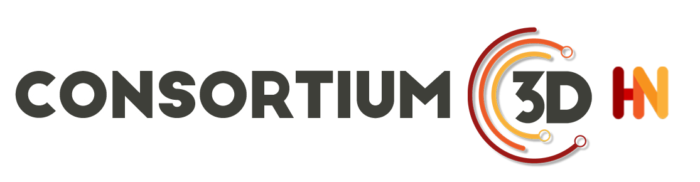

  

# Territoires et immersions 

Date : 11 mai 2023 - en présentiel
Lieu : Ecole Nationale Supérieure d’Architecture de Nantes 

Dans le cadre de l’action de recherche « Au-delà de la 3D » du GdR MAGIS et en collaboration avec le GdR IG-RV et le Consortium 3D-SHS, nous organisons une journée d’animation scientifique sur le thème « Territoires et immersions ».
 
Les progrès technologiques de ces dernières décennies et l’intérêt croissant pour les doubles numériques des espaces construits ont conféré à la 3D une place majeure, avec une production massive de données représentant les territoires à différentes échelles et dont la captation, la manipulation, l’analyse, et la restitution mobilisent diverses techniques à la croisée des domaines des sciences de l’information géographique et de l’informatique graphique. L’introduction de nouvelles modalités d’utilisation de ces données ouvre la voie à une meilleure compréhension des territoires d’étude : il est ainsi possible de faire converger différents états passés, présents, futurs, ou hypothétiques d’un même territoire, de modéliser ou simuler différents processus, d’étudier le ressenti des usagers… En bouleversant la place du sujet face aux données qu’il manipule, la réalité augmentée permet de compléter in situ des représentations de territoires avec des éléments normalement invisibles ou non encore construits et la réalité virtuelle offre d’aller dorénavant « au-delà de la 3D » en révélant des potentialités ou des réalités alternatives. A travers cette journée d’étude centrée sur les modes de visualisation, nous proposons de partager les avancées de la recherche sur ces enjeux, d’en soulever des perspectives et thématiques émergentes, mais aussi d’échanger autour de retours d’expériences sur des objets d’étude particuliers.
 

