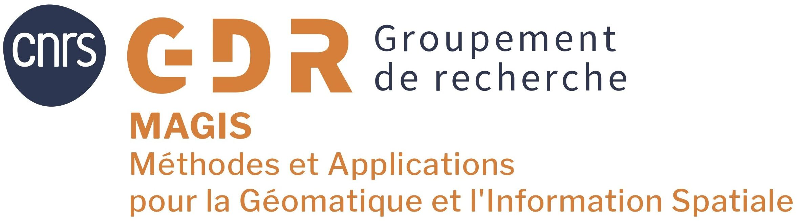

 

  
  
 

# Journées Territoires et Immersion(s) 2024 - Lyon

Dans le cadre de l’action de recherche « Au-delà de la 3D » du GdR MAGIS et en collaboration avec le GdR IG-RV et le Consortium 3DHN, nous organisons deux journées d’animation scientifique sur le thème « Territoires et immersions ».

- Lundi 17 juin (urbanLAB - ERASME)
- Mardi 18 juin matin (Campus LyonTech-la Doua)

 

 

Du fait de leur nature spatiale et temporelle, les données territoriales sont intrinsèquement complexes, et souvent volumineuses. De plus, la diversité de leurs champs d’application conduit généralement à des corpus hétérogènes, mêlant par exemple des simulations thermiques, des hypothèses archéologiques ou encore des évaluations et représentations des qualités perceptives des espaces. Il en résulte une grande diversité d’approches, notamment en termes de modélisation (qu’elle soit géométrique, conceptuelle …) et, de fait, de grandes difficultés dans le traitement des données, en particulier lorsqu'il s’agit d’exploiter des corpus de provenances distinctes. Il devient alors nécessaire d’adopter des postures transversales, et d’interroger différentes disciplines pour comprendre précisément leurs manières de collecter, manipuler et interpréter les données territoriales à travers leurs outils théoriques, méthodologiques et opérationnels. En ce sens, la création d’un espace commun de discussion s’avère précieuse pour aboutir à un enrichissement mutuel inhérent aux approches pluridisciplinaires.

La journée d'étude « **Territoires et immersion(s)** » prend comme postulat de départ que pour saisir l'essence d'un territoire, s'y immerger est nécessaire. Si l'immersion in situ, pratiquée en Sciences Humaines et Sociales, est certes riche d'enseignement, l’immersion numérique constitue une approche complémentaire qui offre une expérience interactive et reproductible des territoires. Qu’elle s’appuie ou non sur le recours aux réalités étendues, l'immersion dans les données territoriales peut constituer la base de cet espace commun de discussion, les approches immersives et l’hybridation réel/virtuel ayant largement prouvé leurs valeurs pédagogiques, aussi bien par la représentation interactive des espaces physiques que des objets abstraits. Cependant, quelles que soient les qualités d'une représentation interactive, il est nécessaire de garder à l'idée qu'elle vise avant tout une analyse collective, un partage d'information ou la découverte d'un territoire. Il s’agit donc d’un objet de médiation dont les contours sont à définir selon les usages auxquels il est destiné, et parallèlement, les usages sont à définir selon les capacités de la représentation à restituer les notions clés des thématiques impliquées.

À travers ces journées, nous proposons d’explorer la triple capacité des outils numériques (en particulier 3D) à **enregistrer** les objets d'étude, à en **faciliter l'expression de la complexité** par la restitution des dimensions matérielles ou immatérielles et à **restituer le résultat d'interprétations issues de nombreux points de vue**. Nous proposons de partager les avancées de la recherche sur ces enjeux, d’en soulever des perspectives et thématiques émergentes, mais aussi d’échanger autour de retours d’expériences sur des cas d’étude concrets, et de mettre en pratique ces éléments avec un atelier de découverte de la plateforme iTowns (http://www.itowns-project.org/).

## Liste de thèmes (non exhaustive) :
- Approches collaboratives et pluridisciplinaires
- Visualisation et analyse de données multidimensionnelles
- Territoires augmentés
- Usages de l’immersion
- Réalités étendues
- Dispositifs techniques d’immersion
- Modalités sensorielles
- Modalités d’interaction

## Programme :
- Lundi 17 juin (urbanLAB - ERASME)
  - Présentation invitée de Gilles Gesquière (LIRIS, Université Lumière Lyon 2)
  - Présentations des participants
  - Démonstrations ERASME
- Mardi 18 juin matin (Campus LyonTech-la Doua)
  - Atelier iTowns

Le programme détaillé sera diffusé fin mai.

## Participation :
Pour soumettre une présentation, vous pouvez envoyer vos propositions de communications en soumettant un résumé d’environ 500 mots avant le **13 mai** à l’adresse : territoires_et_immersions@crenau.archi.fr

## Inscriptions :
Inscriptions gratuites et obligatoires, à la journée de présentation et démos et/ou à l'atelier iTowns avant le **7 juin** à sur **[ce formulaire](https://forms.gle/FisZ6rv4X45GyEKk6)**.

## Organisation :
- Préparation journées : Myriam Servières (AAU, Centrale Nantes), Violette Arbergel (MAP, CNRS), Vincent Tourre (AAU, Centrale Nantes), Mehdi Chayani (Archeoscience Bordeaux, CNRS), Xavier Granier (LP2N, IOA)
- Atelier iTowns : Mathieu Brédif (LASTIG, IGN), Gérald Choqueux (LASTIG, IGN), Éric Boix (LIRIS, CNRS)

