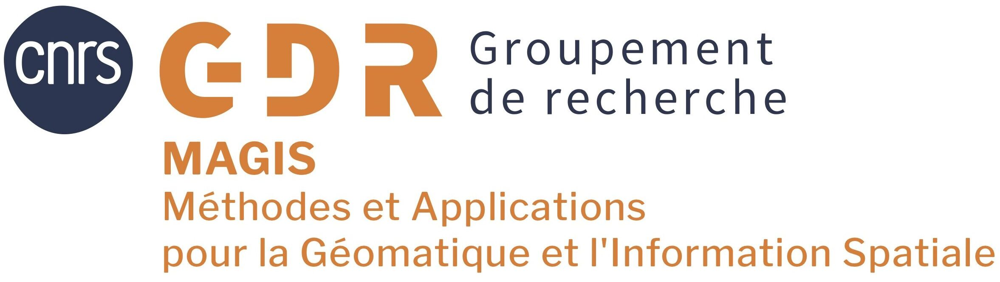
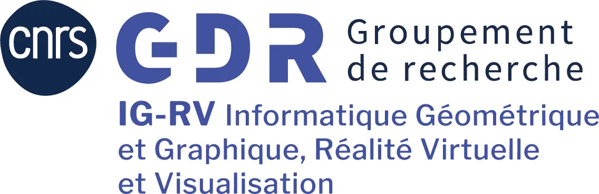
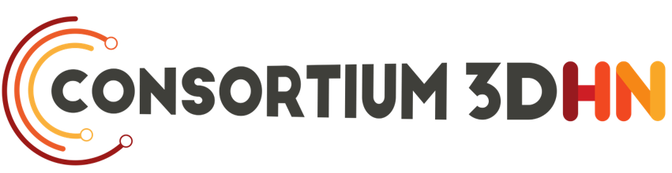
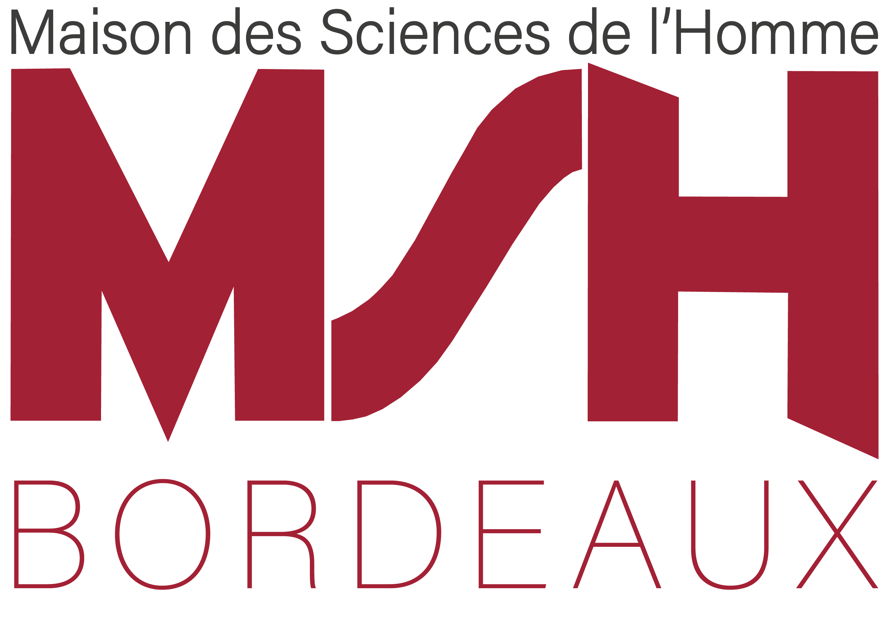
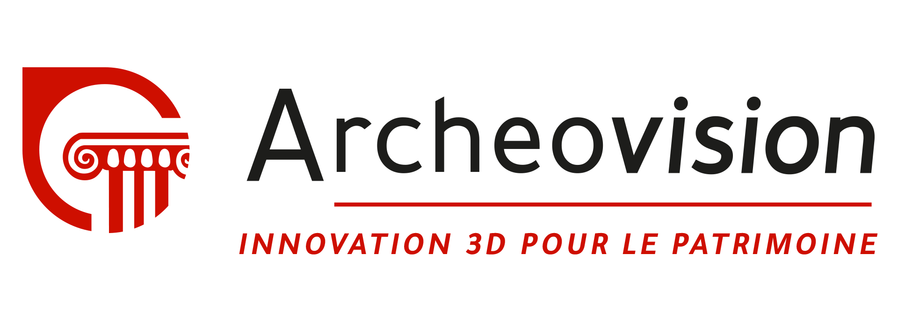

  
  
 

# Journée Territoires et Immersion(s) 2025 - 9 octobre - Pessac

  
 
 

## Lieu : MSHA Bordeaux [10 esplanade des Antilles, 33600 Pessac](https://www.openstreetmap.org/way/226888020#map=19/44.794290/-0.618819)

## Rencontre géomatique, informatique graphique et humanités numériques

**Mots clés** : Immersion ; Réalités étendues ; Territoires augmentés ; Visualisation ; Interaction ; Collaboration ; Pluridisciplinarité ; Données multidimensionnelles

Dans le cadre de l’action de recherche « Au-delà de la 3D » du [GdR MAGIS](https://gdr-magis.cnrs.fr/) et en collaboration avec le [GdR IG-RV](https://gdr-igrv.fr/) et le [Consortium 3DHN](https://shs3d.hypotheses.org/), nous organisons une journée d’animation scientifique sur le thème « Territoires et immersions ».

La journée d’étude « **Territoires et immersion(s)** » explore l’immersion comme moyen de saisir l’essence d’un territoire. L’immersion, qu’elle soit liée à l’usage des réalités étendues, ou prise dans son acception plus large comme un moyen d’explorer des données interconnectées sur les plans spatial, géométrique, ou encore sémantique, a prouvé sa valeur pédagogique pour représenter les espaces physiques et les objets abstraits. Cette immersion, qui se base sur des représentations interactives visant l’analyse collective, le partage d’information ou la découverte d’un territoire, constitue un espace commun de discussion. Il s’agit donc d’un objet de médiation dont les contours sont à définir selon les usages, et les usages selon les capacités de la représentation à restituer les notions clés.

Nous partagerons les avancées de la recherche sur ces enjeux, soulèverons des perspectives et thématiques émergentes, et échangerons autour de retours d’expériences sur des cas d’étude concrets, ainsi que dans un atelier proposé par le [Consortium 3DHN](https://shs3d.hypotheses.org/) : Sauvegarde pérenne des données 3D.

## Programme :
9 octobre - Journée Territoires et Immersion(s) - Présentations et Atelier
- 9h **Accueil**
- 9h15 **Introduction** de la journée (Organisateurs) - Présentation de la plateforme Archeovision (R. Chapoulie) 
- 9h30 **Session #1 Modèles** 
	- <i>Rejeu et annotation temporelle de modèles 3D</i>  
	(<ins>Agnès Arnould</ins>, <ins>Hakim Ferrier-Belhaouari</ins>, XLim/Univ. Poitiers) [Présentation](Territoires_et_immersions_2025_Anould.pdf)
	- <i>Géolocalisation XR Outdoor : méthode de visualisation de projet d'urbanisation géoréférencé</i>  
	(<ins>Corentin Le Bihan Gautier</ins>, Mathieu Brédif, LASTIG/IGN) [Présentation](Territoires_et_immersions_2025_Gautier.pdf)
	- <i>La Forêt de Notre-Dame de Paris, entre immersions numérique et culturelle</i>  
	(<ins>Kévin Jacquot</ins>, MAP/ENSAL) [Présentation](Territoires_et_immersions_2025_Jacquot.pdf)
- 11h Pause
- 11h30 **Session #2 Lumière**
	- <i>Night Sky Explorer VR: Immersive Visualization of Territories Under Artificial Light</i>  
	(<ins>Maxim Spur</ins>, ENIB/Lab-STICC, Philippe Deverchère, ScotopicLabs, Olivier Augereau, ENIB/Lab-STICC, Edna Hernández González, Laboratoire Géoarchitecture)
	- <i>SensiLum VR: Experiencing Territories Through the Eyes of Animals Under Artificial Light</i>  
	(Olivier Augereau, ENIB/Lab-STICC, <ins>Maxim Spur</ins>, ENIB/Lab-STICC, Edna Hernández González, Laboratoire Géoarchitecture, Yoann Roulet, Laboratoire Géoarchitecture, Julien Soler, Virtualys)
	- <i>Perception and Representation of Urban Night Lighting Ambiances in Virtual Reality</i>  
	(<ins>Anthony Le Gourriérec</ins>, ECN/AAU, IMT/INUIT, Observatoire de la nuit, Myriam Servières, ECN/AAU, Etienne Peillard, IMT/INUIT, Nicolas Houel, Observatoire de la nuit) [Présentation](Territoires_et_Immersions_2025_Le_Gourrierec.pdf)
- 13h Pause déjeuner / **Démonstrations**
	- La visite augmentée des églises rupestres de Lalibela : proposée en réalité mixte sur casques Hololens, illustrera une expérience immersive guidée dans un lieu patrimonial d’exception.
	- La reconstitution virtuelle de la grotte d’Iroungou : Une visite virtuelle de la grotte d’Iroungou via des casques Quest, offrant une exploration d’un espace riche en vestiges et objets archéologiques enfouis depuis le XIVème siècle. 
- 14h30 **Présentation SIR 3D** (B. Dutailly / M.Constant / V. Baillet) [Présentation](Territoires_et_immersions_2025_SIR3D.pdf) 
	- SIR 3D, un système d’information référencé en 3D temps réel, permettant le croisement de données spatiales hétérogènes sur support 3D, sera présenté comme outil de suivi patrimonial et d’aide à la recherche. 
- 15h30 Pause
- 16h **Atelier Archivage des données 3D / aLTAG3D** (S. Tournon / M. Chayani) [Présentation](Territoires_et_immersions_2025_Archivage3D.pdf)
	- Initiation aux enjeux de la préservation des données 3D, démonstration de dépôt de jeux de données dans le [Conservatoire national des données 3D](https://3d.humanities.science/) à l'aide du logiciel aLTAG3D. Les participants sont invités à venir avec leurs propres jeux de données (modèle 3D / txt / jpg / etc.) afin de tester l’outil, ainsi qu'un ordinateur avec Windows. (en collaboration avec le [Consortium 3D HN](https://shs3d.hypotheses.org/))
- 17h30 fin

## Inscriptions :
Inscriptions gratuites et obligatoires, à la journée de présentation et/ou à l'atelier avant le **26 septembre** à sur **[ce formulaire](https://forms.gle/FisZ6rv4X45GyEKk6)**.

## Organisation :
- Préparation journées : Myriam Servières (AAU, Centrale Nantes), Violette Arbergel (MAP, CNRS), Vincent Tourre (AAU, Centrale Nantes), Mehdi Chayani (Archeoscience Bordeaux, CNRS), Florent Laroche (LS2N, Centrale Nantes), Xavier Granier (LP2N, IOA)

## Accès
Lieu : MSHA Bordeaux (10 esplanade des Antilles , 33600 Pessac) 

Le site est situé sur le campus de l’Université Bordeaux Montaigne à Pessac, au niveau de l’Esplanade des Antilles.

Trois moyens de transport permettent de s’y rendre depuis la gare de Bordeaux-Saint-Jean :

**- Accès le plus rapide : TER + Tram B (Recommandée pour sa rapidité)**

Prendre un TER à la gare de Bordeaux-Saint-Jean en direction de Pessac (coût 2.50 euros) , descendre à la gare de Pessac (environ 8 minutes de trajet), puis prendre le tram B  direction Bordeaux berges de la Garonne/ Bordeaux Claveau, et descendre à l’arrêt Unitec (environ 5 minutes de trajet). Terminer par une courte marche de 5 minutes.

Durée totale estimée : 15 minutes (hors attente).

**- Accès direct par Tram B uniquement**

Depuis la gare Saint-Jean, rejoindre l’arrêt de tram C (ligne Gare Saint-Jean → Quinconces). À l’arrêt Quinconces, prendre le tram B direction Pessac Centre / Alouette-France. Descendre à l’arrêt Unitec, puis marcher 5 minutes jusqu’au site.

Durée totale estimée : 35 à 45 minutes

**- Accès Bus 9**

Prendre le bus 9 (direction Brandenburg) devant la gare de Bordeaux-Saint-Jean jusqu’à l’arrêt Barrière Saint-Genès.
À Barrière Saint-Genès, monter dans le tramway ligne B, direction Pessac Centre ou Alouette-France, et descendre à Unitec. À l’arrêt Unitec, prévoir une courte marche d’environ 5 minutes.

Temps total estimé à 37 minutes

Horaire Tramway : https://www.infotbm.com/fr               

Horaire TER: https://www.sncf-connect.com/

