#  Webinar 3D et geospatial
Le Webinar 3D « autour de la 3D » est co-organisé par le [GDR CNRS MAGIS](http://gdr-magis.imag.fr/) et le [GDR CNRS IG-RV](https://gdr-igrv.icube.unistra.fr/index.php/Accueil). 

 Il s'agit d'un groupe de travail sur la 3D et ses usages pour le territoire. L'approche peut ainsi être thématique, mais aussi axée sur des problématiques de modélisation, rendu et visualisation.
 
  Le Webinar 3D est un lieu d'échange sur les données géospatiales multidimensionnelles. Les présentations portent sur des recherches en cours (pas forcément abouties), des outils liés à l’étude ou à la représentation de données ou des cas d'utilisation où la donnée 3D a été mobilisée. 
  
  Au cours de chaque session, il s'agit d'une prise de parole de 30 minutes (maximum) suivie de 30 minutes de discussions et échanges, partie importante de ce groupe de travail. 
  
 Le Webinar 3D a pour vocation à se répéter tous les mois (1er jeudi du mois) sur le temps de la pause méridienne (12h30- 13H30) 

 Si vous êtes intéressé.e.s pour faire une présentation, en anglais ou en français, contactez :
Myriam Servières (myriam.servieres@ec-nantes.fr), Sidonie Christophe (sidonie.christophe@ign.fr) ou Gilles Gesquière (gilles.gesquiere@liris.cnrs.fr)

### Voici le lien pour vous connecter (Attention, ce lien pourra changer d'un mois à l'autre)
 * Réunion Microsoft Teams 
 * [Lien Teams](https://teams.microsoft.com/l/meetup-join/19%3ameeting_MGE4YzJmYmItNTc4NC00NDYxLWI2ZTAtYWRhYTdmZWQ5NDUw%40thread.v2/0?context=%7b%22Tid%22%3a%22a51a6642-5911-4306-a13c-f4731ab9c63f%22%2c%22Oid%22%3a%225aa46b1d-96d9-42ab-97d2-667015fd6243%22%7d)

 
<!-- * https://ec-nantes.zoom.us/j/96084452785

* ID de réunion : 960 8445 2785
* Code secret : maGIS#2022 -->

### Présentations 2022/ 2023 (programme en cours de construction)

 * 6 juillet 2023
 * 1er juin 2023
 * 4 mai 2023
 * 6 avril 2023
 * 2 mars 2023 - 12h30 [Valerio Signorelli (UCL)](https://www.ucl.ac.uk/bartlett/casa/valerio-signorelli)
 * 2 février 2023 - 12h30 [Barbara Piga, Polimi](http://www.labsimurb.polimi.it/about-2/people/barbara-piga/)
 * 5 janvier 2023 - 12h30 [Mohamed Amin Hammami,  Imam Abdulrahman Bin Faisal University. Dammam, KSA](https://www.geomatics-cc-mah.com/rig) Vers un observatoire acoustique et psychoacoustique de paysages sonores en milieu urbain
 * 1er décembre 2022 - 12h30 Iris De Gelis (OBELIX-IRISA) "3D point clouds change detection: from supervised to unsupervised deep learning methods"
 * 10 novembre 2022 - 12h30 [Benjamin Beaucamp, AAU-CRENAU](https://aau.archi.fr/equipe/beaucamp-benjamin/) "Vers une visualisation située d’une cartographie sensible des villes -
Qualification par apprentissage automatique de la perception de l'espace urbain par un piéton en mobilité"
 * 6 octobre 2022 - 12h30 [Filip Biljecki, National University of Singapore](https://filipbiljecki.com)

### Présentations 2021/2022 

* 07/07/2022 - 12h30 
  * Clément Colin, Corentin Gautier, Diégo Vinasco - LIRIS CNRS - [Urban Data, services and visualizations](2022_07_07_UDSV_Urban_Data_Services_and_Visualizations.pdf)  

* 02/06/2022 - 12h30 

   *  Nicolas Mellado - IRIT CNRS - [Réseaux de neurones pour le traitement de nuages de points 3d acquis: approches rapides, robustes, et à faible impact énergétique](2022_06_webinar_Mellado_compr.pdf). Des jeux de données lié à ces travaux est disponible [ici](https://3dard.cnrs.fr).
  
   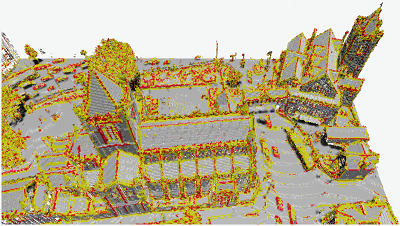
   
* 05/05/2022 - 12h30 
  
  * Adrien Peytavie- LIRIS CNRS- [Construction de mondes virtuels par génération procédurale](2022_05_05_A_Peytavie_Webinar_Roads_2022.pdf)

* 07/04/2022 - 12h30

   *  Adeline Manuel - MAP CNRS - Aioli, une plateforme d'annotation sémantique pour la documentation collaborative d'objets patrimoniaux. 

  

* 03/03/2022 - 12h30 - Annulé

   *  Mickaël Brasebin - Agence alpine des territoires - Simuler l'impact de la réglementation urbaine sur la morphologie du bâti

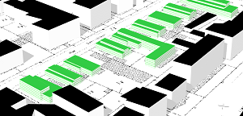 

* 03/02/2022 - 12h30 

   *  Florence Jacquinod & Adeline Deprêtre - Lastig, Univ. G. Eiffel - [Usages d'un CIM 3D pour l'aménagement -projet La Vallée, ISite-Eiffage](2022_02_MAGIS_Depretre_Jacquinod_E3S.pdf)
   
   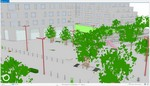

*  06/01/2022 - 12h30
  
   * Xavier Granier - L2PN, Bordeaux- [Les challenges de la 3D pour l'étude du patrimoine](2022-01-07_Granier_3DPatrimoine.pdf)
     
     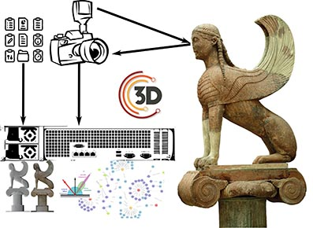
 
*  02/12/2021 - 12h30
   * Abdoulaye Diakite - Faculty of Built Environment, UNSW, Sydney, Australia- [Modélisation 3D unifiée de l'espace pour une navigation intérieure/extérieure fluide.](2021__12_02_Abdou_Modelisation_Unifiee_Navigation.pdf)

   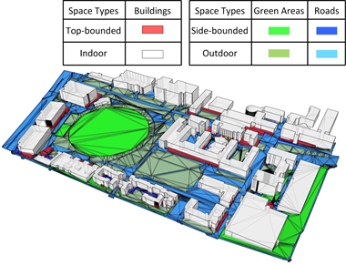

*  04/11/2021 - 12h30
   *  Thibaud Chassin - HEIG-VD / EPFL - [3D et e-participation dans l'aménagement du territoire](20211104_Webinar3D_MAGIS_Regards_on_3D_Participatory_E-Planning_Through_3_Project_Proposals_Thibaud_Chassin.pdf)
   
   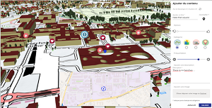
 
*  07/10/2021 - 12h30
   *  Mathieu Brédif - LASTIG - [Navigation immersive dans des photographies historiques (ANR ALEGORIA)](webinar_magis_igrv_bredif_20211007.pdf)
   
   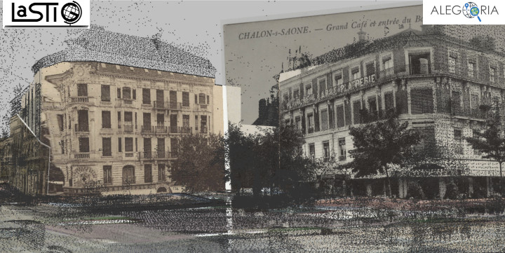

### Présentations 2020/2021
* 01/07/2021 - 12h30
  * Arnaud Prouzeau - Inria/POTIOC - Visualisation immersive de données spatiales
 
   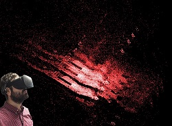
   
* 03/06/2021 - 12h30
  * Thomas Leduc - UMR AAU - [3D et analyse visuelle des environnements urbains](20210603_Webinar3D_MAGIS_tleduc.pdf) - [Résumé](20210603_Resume_leduc.md)

  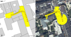 
  

* 01/04/2021 - 12h30
   *  Violette Abergel - UMR MAP, CNRS - [Une plateforme numérique pour la documentation du chantier scientifique de Notre-Dame de Paris.](2021_Webinar3D_VAbergel_MAP.pdf)
   
   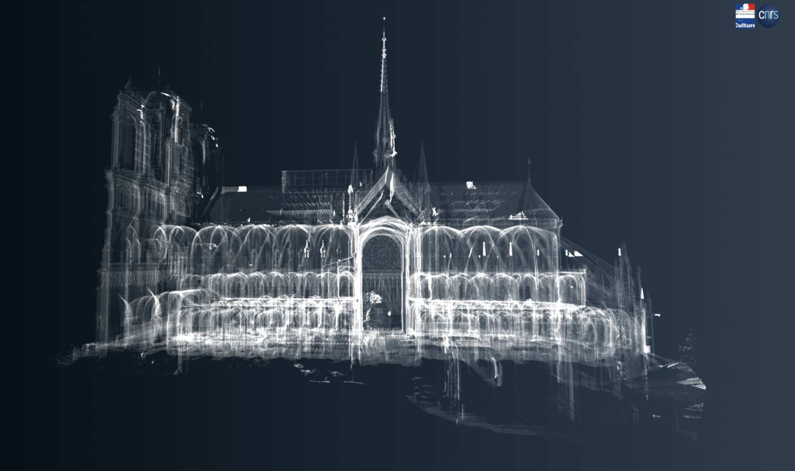

* 04/03/2021 - 12h30

   *  Jacques Gautier - Lastig, Univ. G. Eiffel - [Visualisation de données de températures simulées en milieu urbain.](2021034_Webinar3D_MAGIS_TempAndUrbanData_JGautier.pdf)

   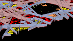 [Vidéo](2021034_Webinar3D_MAGIS_TempAndUrbanData_JGautier.mp4)

* 04/02/2021 - 12h30
   *  Pierre-Olivier Mazagol - Univ. Saint-Etienne, EVS - Géovisualisation 3D du patrimoine englouti.
   
   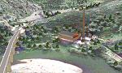 [Lien vers la story Map de présentation](https://arcg.is/vrbXH)

*  07/01/2021 - 12h30
   * Gabriel Giraldo - AAU-CRENAU - [Perception d'une Représentation Multisensorielle du Vent en Réalité Virtuelle.](20210107_AAU_Giraldo_VentRV.pdf)
   
   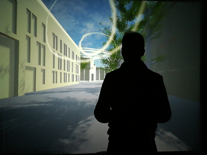

*  03/12/2020 - 12h30
    * Boris Mericskay - Univ. Rennes 2 - [Intégrer de la 3D dans les cartes en lignes avec WebGL.](20201203_Webinar_3D_BM.pdf)
   
    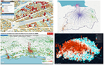
    
*  05/11/2020 - 12h30
   * Gilles Gesquière, Corentin Gautier, Homère Bourgeois - Univ. Lyon- LIRIS - [3D, 4D et interfaces avec les territoires](2020_11__05_Liris_Datagora.pdf)
  
   
  
 *  04/06/2020
    * Vincent Jaillot - [LIRIS Modéliser et visualiser la ville 4D (3D + temps)](2020_06_02-MAGIS-VJaillot.pdf)
    
    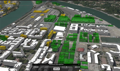

 * 02/04/2020
    * Gilles Gesquière, Eric Boix, Vincent Jaillot – LIRIS - [Outils de développements 3D (stockage, traitement et visualisation)](Webinar3D_Gesquiere.pptx.pdf) 
    
    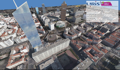  
    
 *  06/02/20
    * Evelyn Paiz-Reyes – LaSTIG/GeoVis - [Image based rendering of large historical image collections (projet ANR ALEGORIA)](20200206_Webinar3D_MAGIS_ImageBasedRendering_HistoricalImages_Paiz_Reyes.pdf)    
    
    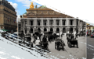 

* 12/12/19 
    * Alexandre Devaux – LaSTIG/GeoVis - [3D Maps - today and tomorrow, from desktop to outdoor mixed reality](20191212_Webinar3D_MAGIS_3DMapsThroughTime_Devaux.pdf)
    
     
  
 *  03/10/19
    * Maxim Spur – AAU/CRENAU - [Immersive Visualization of Multilayered Geospatial Urban Data](20191003_Webinar3D_MAGIS_ImmersiveVisualization_Spur.pdf)

    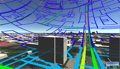 
 
